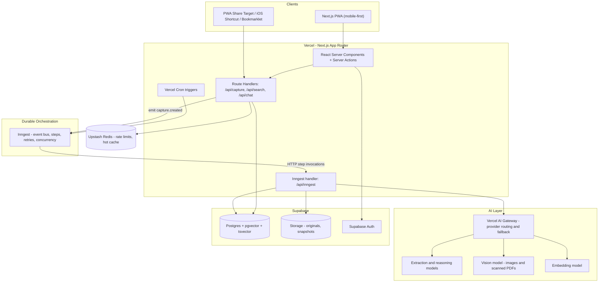
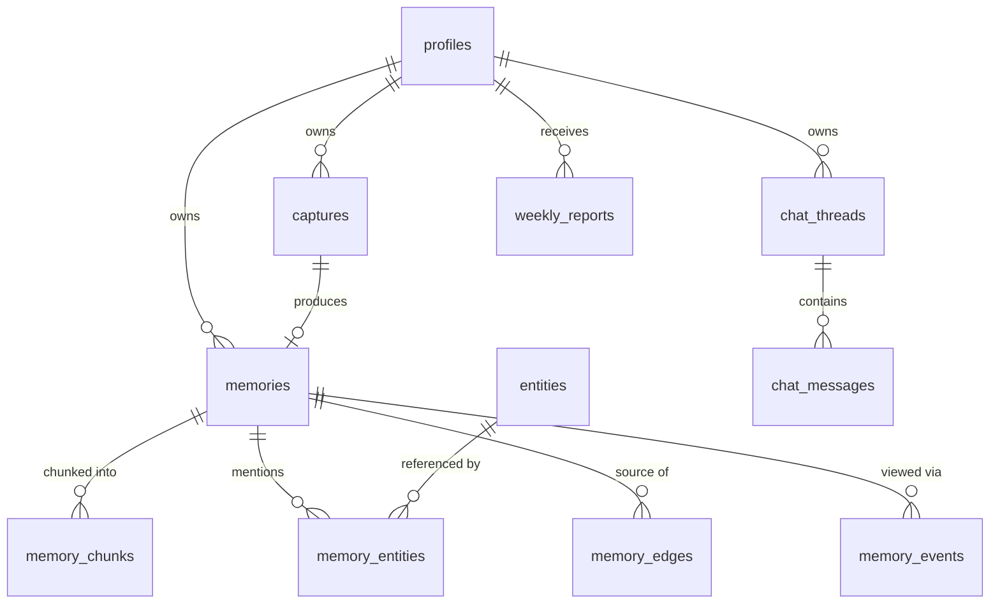
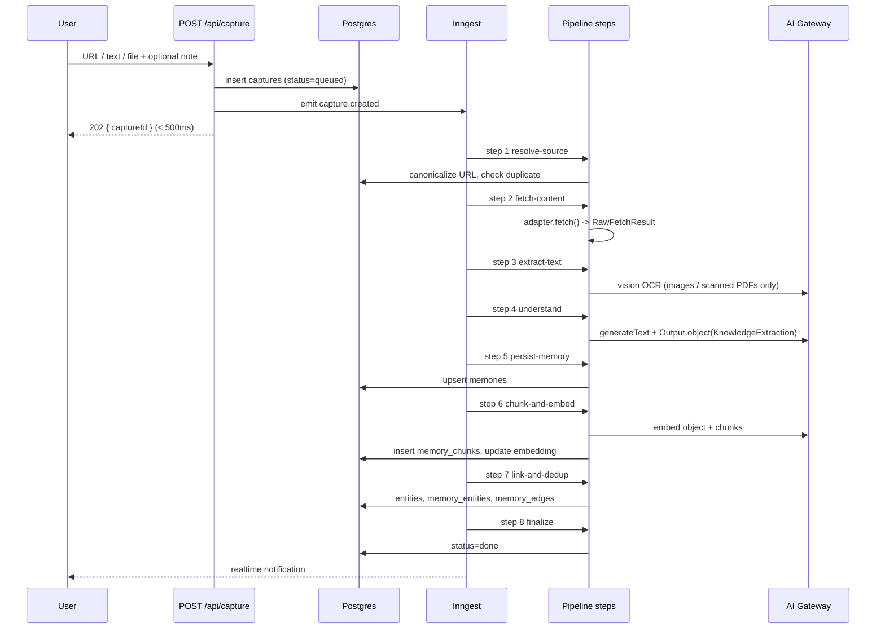
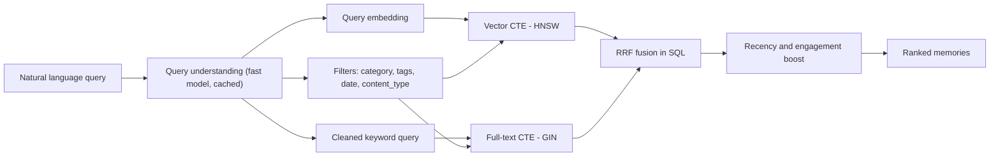

# Lyvora - System Design Document

**Version:** 1.0 (MVP)
**Status:** Draft
**Companion to:** [Lyvora_prd.md](Lyvora_prd.md)
**Stack:** TypeScript end-to-end (Next.js App Router + Node workers)
**Hosting target:** Vercel + Supabase + managed AI APIs (low-cost / free-tier first)

---

## 1. Purpose and Scope

This document translates the [PRD](Lyvora_prd.md) into a buildable system. It defines the architecture, data model, processing pipeline, retrieval strategy, APIs, and a phased build plan for the MVP.

### In scope for MVP

Derived from PRD §8 (Content Sources) and §27 (MVP Success Criteria):

- Capture from **URL**, **raw text**, **PDF**, and **image**
- Automatic extraction, summarization, categorization, tagging, entity extraction
- Zero-folder organization (AI-generated categories)
- Natural-language search (hybrid semantic + keyword)
- Chat over saved knowledge (RAG)
- Original source viewing and rediscovery surfaces
- Duplicate detection and basic relationship linking
- Weekly report generation

### Explicitly out of scope for MVP

Platform-specific integrations (Instagram, YouTube, Amazon, Reddit, Gmail, Notion), browser extension, native mobile apps, video/audio transcription, team/shared workspaces. The architecture below reserves seams for all of these — see §7 (Source Adapters) and §21 (Extension Points).

### Non-functional targets

| Concern | Target |
| --- | --- |
| Capture acknowledgement | < 500 ms (p95), pipeline runs async |
| Full pipeline completion | < 30 s p50, < 90 s p95 for a text article |
| Search latency | < 400 ms p95 end-to-end |
| Chat first token | < 1.5 s p95 |
| Cost per captured item | < $0.01 average |
| Availability | Best-effort single-region; capture must never lose data |

---

## 2. Design Principles

These are the engineering constraints that fall directly out of the PRD's product philosophy (§3, §9, §26).

1. **Capture is sacred.** Accepting an input must never fail because AI or extraction failed. Persist the raw input first, process later, retry forever.
2. **Every source enters one pipeline.** PRD §10. Sources differ only in an adapter that produces a normalized `ExtractedContent`.
3. **Adding a source is a plugin, not a refactor.** PRD §8. New sources implement one interface and register themselves.
4. **The Knowledge Object is the contract.** PRD §11. Everything downstream (search, chat, graph, reports) reads only the Knowledge Object, never source-specific shapes.
5. **AI output is structured and validated.** Every LLM call returns schema-validated JSON. Unvalidated model output never reaches the database.
6. **Idempotent and resumable.** Any pipeline step can be re-run without corrupting state. Steps are individually retried and individually cached.
7. **Cheap by default, expensive on demand.** Route to the smallest capable model; escalate only on low confidence or rich media.
8. **Private by construction.** Row-Level Security on every table; a user's data is unreachable by another user even if application code has a bug.

---

## 3. High-Level Architecture



### Why this shape

- **Vercel + Next.js** gives one deployable unit for UI, API, and workers. RSC keeps the memory list fast on mobile.
- **Inngest** solves the core problem that the ingestion pipeline exceeds a serverless timeout as a whole but not step-by-step. Each step (fetch, extract, summarize, embed) is a separate short HTTP invocation with independent retries, so the pipeline runs for minutes on infrastructure with a 60-second ceiling, with zero extra infra to operate. Free tier covers early usage.
  - *Escape hatch:* if a single step ever needs more than ~60 s of compute in one shot (video transcription, OCR of a 300-page PDF), move that one step to **Trigger.dev**, which has no execution-time limit, and keep the rest on Inngest. The step interface in §6 is written so this is a one-file change.
- **Supabase Postgres** is the single source of truth: relational data, JSONB structured payloads, `pgvector` embeddings, and `tsvector` full-text in the *same* database. One query can filter, rank semantically, and rank lexically without a network hop to a separate vector store. At Lyvora's scale this is both faster and cheaper than a dedicated vector DB.
- **Vercel AI Gateway** keeps model choice a config value, not a code dependency, and provides automatic failover between providers.

---

## 4. Technology Choices

| Layer | Choice | Rationale |
| --- | --- | --- |
| Framework | Next.js 16, App Router, React Server Components | One codebase for UI + API + jobs; streaming UI for chat |
| Language | TypeScript (strict) | Shared types from DB schema to UI |
| Styling | Tailwind CSS v4 + shadcn/ui + Radix | Mobile-first, accessible, fast to build a beautiful UI (PRD §26) |
| DB | Supabase Postgres 16 + pgvector 0.8 | Relational + vector + FTS in one place, RLS built in |
| ORM | Drizzle ORM | Typed SQL, first-class `vector` support, easy raw SQL for RRF |
| Auth | Supabase Auth (email OTP + Google OAuth) | Integrates with RLS via `auth.uid()` |
| Object storage | Supabase Storage | Originals (PDF, image), HTML snapshots, thumbnails |
| Jobs | Inngest | Durable multi-step workflows on serverless (see §3) |
| AI SDK | Vercel AI SDK 6 | `generateText` + `Output.object()` for validated structured output; `streamText` + `useChat` for chat |
| Model routing | Vercel AI Gateway | Provider-agnostic; failover; unified usage accounting |
| Validation | Zod | One schema drives LLM output validation, API validation, and TS types |
| Rate limit / cache | Upstash Redis | Serverless-native, free tier |
| Email | Resend | Weekly report delivery |
| Observability | Vercel Analytics + Sentry + Inngest dashboard | Errors, traces, per-run pipeline visibility |
| Tests | Vitest (unit), Playwright (e2e) | Adapter and extraction logic are the highest-value unit tests |

### Model routing policy

Models are referenced by **role**, never by name, in application code. Roles map to model IDs in one config file.

| Role | Default model | Used for |
| --- | --- | --- |
| `fast` | Gemini 2.x Flash class | Classification, tagging, title cleanup, query rewriting |
| `extract` | Gemini Flash / GPT-5-mini class | Summary + structured field extraction (the main pipeline call) |
| `vision` | Gemini Flash (multimodal) | Image understanding, scanned PDF OCR |
| `reason` | Frontier model | Chat answers, relationship adjudication, weekly report narrative |
| `embed` | `text-embedding-3-small`, 1536 dims | All embeddings |

Escalation rule: if `extract` returns `confidence < 0.6` or fails schema validation twice, retry once with the `reason` model. Log every escalation — a high escalation rate means the prompt, not the model, is wrong.

---

## 5. Data Model

### 5.1 Entity relationships



### 5.2 Core tables

Extensions required: `vector`, `pg_trgm`, `pgcrypto`, `unaccent`.

```sql
-- Mirrors auth.users; holds app-level preferences.
create table profiles (
  id            uuid primary key references auth.users(id) on delete cascade,
  email         text not null,
  display_name  text,
  timezone      text not null default 'UTC',
  interests     jsonb not null default '{}'::jsonb,   -- learned topic weights (PRD 22)
  created_at    timestamptz not null default now()
);
```

**`captures` — the durable inbox.** Written synchronously on capture; the only table the capture endpoint must succeed in writing.

```sql
create type capture_kind   as enum ('url', 'text', 'pdf', 'image');
create type capture_status as enum ('queued','fetching','extracting','enriching','embedding','done','failed','duplicate');

create table captures (
  id             uuid primary key default gen_random_uuid(),
  user_id        uuid not null references profiles(id) on delete cascade,
  kind           capture_kind not null,
  raw_input      text,            -- URL or pasted text
  upload_path    text,            -- Supabase Storage path for pdf/image
  user_note      text,            -- "why did the user save it" (PRD 3)
  client         text,            -- 'web' | 'share_target' | 'shortcut' | 'extension'
  idempotency_key text,
  status         capture_status not null default 'queued',
  attempts       int not null default 0,
  last_error     text,
  memory_id      uuid,            -- FK added after memories is created
  created_at     timestamptz not null default now(),
  updated_at     timestamptz not null default now()
);

create unique index captures_idem_uk
  on captures (user_id, idempotency_key) where idempotency_key is not null;
create index captures_user_status_idx on captures (user_id, status, created_at desc);
```

**`memories` — the Knowledge Object** (PRD §11). This is the central table.

```sql
create type source_type  as enum (
  'web','text','pdf','image',
  -- reserved for post-MVP adapters
  'youtube','instagram','reddit','x','linkedin','github','amazon','medium','notion','gmail'
);

create type content_type as enum (
  'article','video','product','recipe','workout','place','repository',
  'paper','thread','note','document','image','course','tool','other'
);

create table memories (
  id              uuid primary key default gen_random_uuid(),
  user_id         uuid not null references profiles(id) on delete cascade,
  capture_id      uuid references captures(id) on delete set null,

  -- Provenance
  source_type     source_type not null,
  source_url      text,
  canonical_url   text,
  url_hash        text,                       -- sha256(canonical_url), for dedup
  site_name       text,
  author          text,
  published_at    timestamptz,

  -- Understanding
  content_type    content_type not null default 'other',
  title           text not null,
  tldr            text,                       -- one line, shown in list view
  summary         text,                       -- 3-6 sentences, shown on detail
  category        text not null default 'Uncategorized',   -- AI-generated (PRD 18)
  tags            text[] not null default '{}',
  language        text default 'en',
  key_points      text[] not null default '{}',

  -- Typed payload, shape depends on content_type (see 5.3)
  structured      jsonb not null default '{}'::jsonb,

  -- Media and originals
  hero_image_url  text,
  storage_path    text,                       -- original file / HTML snapshot
  raw_text        text,                       -- full extracted text

  -- Retrieval
  embedding       vector(1536),
  embedding_model text,
  fts             tsvector generated always as (
                    setweight(to_tsvector('english', coalesce(title,'')),   'A') ||
                    setweight(to_tsvector('english', coalesce(tldr,'')),    'B') ||
                    setweight(to_tsvector('english', coalesce(summary,'')), 'B') ||
                    setweight(to_tsvector('english', array_to_string(tags,' ')), 'C') ||
                    setweight(to_tsvector('english', coalesce(raw_text,'')),'D')
                  ) stored,

  -- AI bookkeeping and lifecycle
  ai_meta         jsonb not null default '{}'::jsonb,   -- model, prompt_version, tokens, cost, confidence
  status          capture_status not null default 'queued',
  duplicate_of    uuid references memories(id) on delete set null,
  is_archived     boolean not null default false,
  is_pinned       boolean not null default false,
  view_count      int not null default 0,
  last_viewed_at  timestamptz,
  saved_at        timestamptz not null default now(),
  updated_at      timestamptz not null default now()
);

alter table captures
  add constraint captures_memory_fk foreign key (memory_id) references memories(id) on delete set null;

-- Indexes
create index memories_user_saved_idx  on memories (user_id, saved_at desc) where not is_archived;
create index memories_user_cat_idx    on memories (user_id, category);
create index memories_tags_idx        on memories using gin (tags);
create index memories_fts_idx         on memories using gin (fts);
create index memories_structured_idx  on memories using gin (structured jsonb_path_ops);
create index memories_embedding_idx   on memories using hnsw (embedding vector_cosine_ops)
  with (m = 16, ef_construction = 64);
create unique index memories_user_url_uk on memories (user_id, url_hash) where url_hash is not null;
```

> **Index operator class matters.** `vector_cosine_ops` must match the `<=>` operator used in queries. A mismatch silently falls back to a sequential scan — correct results, collapsing latency. Verify with `explain analyze` that an *Index Scan using memories_embedding_idx* appears.

**`memory_chunks` — retrieval granularity for chat.** Object-level embeddings answer "which memory?"; chunk-level embeddings answer "what exactly did it say?".

```sql
create table memory_chunks (
  id         uuid primary key default gen_random_uuid(),
  memory_id  uuid not null references memories(id) on delete cascade,
  user_id    uuid not null references profiles(id) on delete cascade,
  ordinal    int not null,
  heading    text,
  content    text not null,
  token_count int,
  embedding  vector(1536),
  fts        tsvector generated always as (to_tsvector('english', coalesce(content,''))) stored,
  unique (memory_id, ordinal)
);

create index chunks_user_idx      on memory_chunks (user_id);
create index chunks_fts_idx       on memory_chunks using gin (fts);
create index chunks_embedding_idx on memory_chunks using hnsw (embedding vector_cosine_ops);
```

**Entities and the knowledge graph** (PRD §19, §25).

```sql
create type entity_kind as enum (
  'person','company','product','technology','ingredient','place','book','movie','topic','exercise','other'
);

create table entities (
  id         uuid primary key default gen_random_uuid(),
  user_id    uuid not null references profiles(id) on delete cascade,
  kind       entity_kind not null,
  name       text not null,
  norm_name  text not null,              -- lower(unaccent(name)), for matching
  aliases    text[] not null default '{}',
  embedding  vector(1536),
  mention_count int not null default 0,
  created_at timestamptz not null default now(),
  unique (user_id, kind, norm_name)
);
create index entities_trgm_idx on entities using gin (norm_name gin_trgm_ops);

create table memory_entities (
  memory_id  uuid not null references memories(id) on delete cascade,
  entity_id  uuid not null references entities(id) on delete cascade,
  role       text,                        -- 'about' | 'mentions' | 'recommends' | 'requires'
  salience   real not null default 0.5,
  primary key (memory_id, entity_id)
);

create type edge_kind as enum ('similar','about_same','follow_up','contradicts','duplicate','part_of');

create table memory_edges (
  id         uuid primary key default gen_random_uuid(),
  user_id    uuid not null references profiles(id) on delete cascade,
  src_id     uuid not null references memories(id) on delete cascade,
  dst_id     uuid not null references memories(id) on delete cascade,
  kind       edge_kind not null,
  score      real not null,
  reason     text,                        -- short LLM justification, shown in UI
  created_at timestamptz not null default now(),
  unique (src_id, dst_id, kind),
  check (src_id <> dst_id)
);
```

**Engagement, chat, and reports.**

```sql
create table memory_events (
  id         bigserial primary key,
  user_id    uuid not null references profiles(id) on delete cascade,
  memory_id  uuid not null references memories(id) on delete cascade,
  kind       text not null,               -- 'view' | 'open_source' | 'search_hit' | 'chat_cite'
  created_at timestamptz not null default now()
);
create index memory_events_user_time_idx on memory_events (user_id, created_at desc);

create table chat_threads (
  id         uuid primary key default gen_random_uuid(),
  user_id    uuid not null references profiles(id) on delete cascade,
  title      text,
  created_at timestamptz not null default now()
);

create table chat_messages (
  id         uuid primary key default gen_random_uuid(),
  thread_id  uuid not null references chat_threads(id) on delete cascade,
  user_id    uuid not null references profiles(id) on delete cascade,
  role       text not null,               -- 'user' | 'assistant'
  content    jsonb not null,              -- AI SDK UIMessage parts
  citations  uuid[] not null default '{}',-- memory ids used in the answer
  created_at timestamptz not null default now()
);

create table weekly_reports (
  id          uuid primary key default gen_random_uuid(),
  user_id     uuid not null references profiles(id) on delete cascade,
  week_start  date not null,
  payload     jsonb not null,             -- counts, top categories, revisit suggestions
  narrative   text,                       -- LLM-written summary
  created_at  timestamptz not null default now(),
  unique (user_id, week_start)
);
```

### 5.3 The `structured` payload

`structured` is a discriminated union keyed on `content_type`, defined once in Zod and reused for (a) the LLM output schema, (b) runtime validation, (c) TypeScript types, and (d) the detail-page renderer. This is what makes the PRD's per-domain workflows (§13–§17) work without per-domain tables.

```ts
// packages/core/src/schemas/structured.ts
import { z } from 'zod';

export const RecipePayload = z.object({
  kind: z.literal('recipe'),
  servings: z.number().int().positive().nullable(),
  totalMinutes: z.number().int().positive().nullable(),
  cuisine: z.string().nullable(),
  difficulty: z.enum(['easy', 'medium', 'hard']).nullable(),
  ingredients: z.array(z.object({
    item: z.string(), quantity: z.string().nullable(), optional: z.boolean().default(false),
  })),
  steps: z.array(z.string()),
  dietaryTags: z.array(z.string()).default([]),   // 'vegan', 'egg-free', 'high-protein'
  nutrition: z.record(z.string(), z.string()).nullable(),
});

export const ProductPayload = z.object({
  kind: z.literal('product'),
  productName: z.string(),
  brand: z.string().nullable(),
  price: z.object({ amount: z.number(), currency: z.string() }).nullable(),
  rating: z.number().min(0).max(5).nullable(),
  features: z.array(z.string()).default([]),
  specs: z.record(z.string(), z.string()).default({}),
  pros: z.array(z.string()).default([]),
  cons: z.array(z.string()).default([]),
  useCases: z.array(z.string()).default([]),
});

export const WorkoutPayload = z.object({
  kind: z.literal('workout'),
  exercises: z.array(z.object({
    name: z.string(),
    targetMuscles: z.array(z.string()).default([]),
    equipment: z.array(z.string()).default([]),
    sets: z.string().nullable(),
    difficulty: z.enum(['beginner', 'intermediate', 'advanced']).nullable(),
  })),
  benefits: z.array(z.string()).default([]),
  warnings: z.array(z.string()).default([]),
  frequency: z.string().nullable(),
});

export const TravelPayload = z.object({
  kind: z.literal('travel'),
  destinations: z.array(z.string()).default([]),
  attractions: z.array(z.string()).default([]),
  hotels: z.array(z.string()).default([]),
  restaurants: z.array(z.string()).default([]),
  bestSeason: z.string().nullable(),
  budget: z.string().nullable(),
  tips: z.array(z.string()).default([]),
});

export const TechPayload = z.object({
  kind: z.literal('tech'),
  technologies: z.array(z.string()).default([]),
  concepts: z.array(z.string()).default([]),
  apis: z.array(z.string()).default([]),
  libraries: z.array(z.string()).default([]),
  bestPractices: z.array(z.string()).default([]),
  codeSnippets: z.array(z.object({ language: z.string(), code: z.string(), note: z.string().nullable() })).default([]),
});

export const GenericPayload = z.object({
  kind: z.literal('generic'),
  facts: z.array(z.string()).default([]),
  actionItems: z.array(z.string()).default([]),
});

export const StructuredPayload = z.discriminatedUnion('kind', [
  RecipePayload, ProductPayload, WorkoutPayload, TravelPayload, TechPayload, GenericPayload,
]);
export type StructuredPayload = z.infer<typeof StructuredPayload>;
```

**Adding a new domain** means: add a Zod schema, add it to the union, add a renderer component keyed by `kind`. Nothing else changes.

### 5.4 Row-Level Security

RLS is enabled on every user-scoped table with the same policy shape. This is the entire privacy guarantee (PRD §26) and it lives in the database, not in application code.

```sql
alter table memories enable row level security;

create policy memories_select on memories for select using (auth.uid() = user_id);
create policy memories_insert on memories for insert with check (auth.uid() = user_id);
create policy memories_update on memories for update using (auth.uid() = user_id);
create policy memories_delete on memories for delete using (auth.uid() = user_id);
```

Repeat for `captures`, `memory_chunks`, `entities`, `memory_entities`, `memory_edges`, `memory_events`, `chat_threads`, `chat_messages`, `weekly_reports`.

Two database roles are used:
- **User-context client** (anon key + user JWT): all read paths and user-initiated writes. RLS enforced.
- **Service-role client**: pipeline workers only, and only inside Inngest functions. Every service-role query must pass `user_id` explicitly — a lint rule and a code-review checklist item.

---

## 6. Ingestion Pipeline

This implements PRD §10 (Universal Capture) and §12 (10-step lifecycle).



### 6.1 Step definitions

Each step is an Inngest `step.run(...)`. Inngest memoizes each step's return value, so a retry resumes from the failed step instead of re-fetching and re-paying for prior LLM calls.

```ts
// apps/web/src/inngest/functions/process-capture.ts
export const processCapture = inngest.createFunction(
  {
    id: 'process-capture',
    retries: 4,
    concurrency: [{ key: 'event.data.userId', limit: 3 }],   // fairness across users
    onFailure: markCaptureFailed,
  },
  { event: 'capture.created' },
  async ({ event, step }) => {
    const { captureId, userId } = event.data;

    const resolved = await step.run('resolve-source', () => resolveSource(captureId));
    if (resolved.duplicateOf) {
      return step.run('merge-duplicate', () => mergeIntoExisting(captureId, resolved.duplicateOf));
    }

    const fetched   = await step.run('fetch-content',    () => adapters.for(resolved).fetch(resolved));
    const extracted = await step.run('extract-text',     () => extractText(fetched));
    const knowledge = await step.run('understand',       () => understand(extracted, resolved.userNote));
    const memoryId  = await step.run('persist-memory',   () => persistMemory(userId, captureId, extracted, knowledge));
    await step.run('chunk-and-embed', () => chunkAndEmbed(memoryId, extracted, knowledge));
    await step.run('link-and-dedup',  () => linkAndDedup(memoryId, userId));
    await step.run('finalize',        () => finalize(captureId, memoryId));

    return { memoryId };
  },
);
```

### 6.2 Step responsibilities

**1. resolve-source** — Canonicalize the URL (strip `utm_*`, `fbclid`, `ref`, trailing slash; resolve redirects; lowercase host; drop `www.`), compute `url_hash`, pick the adapter via the registry, and check `memories_user_url_uk` for an exact prior save. Exact URL match short-circuits to merge — no AI spend on a re-save.

**2. fetch-content** — Adapter-specific. See §7.

**3. extract-text** — Normalize whatever the adapter returned into clean text plus a heading outline.
- HTML: `@mozilla/readability` over `linkedom` (serverless-safe, no headless browser). Falls back to `r.jina.ai` reader for JS-heavy pages.
- PDF: `unpdf` (serverless build of pdf.js). If extracted text is under ~200 characters, the PDF is scanned — route pages to the `vision` model for OCR.
- Image: `vision` model returns OCR text plus a visual description.
- Text: pass through.

**4. understand** — The single most important call. One `generateText` with `Output.object()` produces every AI field at once, which is cheaper and more coherent than separate summarize/categorize/tag calls.

```ts
const KnowledgeExtraction = z.object({
  title:       z.string().max(140),
  contentType: z.enum(CONTENT_TYPES),
  tldr:        z.string().max(180),
  summary:     z.string(),
  keyPoints:   z.array(z.string()).max(8),
  category:    z.enum(CATEGORY_TAXONOMY),      // closed set, see below
  tags:        z.array(z.string()).max(10),
  language:    z.string(),
  entities:    z.array(z.object({ name: z.string(), kind: z.enum(ENTITY_KINDS), salience: z.number().min(0).max(1) })).max(20),
  structured:  StructuredPayload,
  confidence:  z.number().min(0).max(1),
});

const { output, usage } = await generateText({
  model: models.extract,
  output: Output.object({ schema: KnowledgeExtraction }),
  system: EXTRACTION_SYSTEM_PROMPT,        // versioned constant
  prompt: buildExtractionPrompt({ text, metadata, userNote }),
});
```

The input text is truncated to a budget (~12k tokens) using head + heading-aware middle sampling + tail, so cost per item stays bounded regardless of document size.

**Category taxonomy.** PRD §18 says categories are AI-generated, but a fully open set fragments ("Cooking" vs "Recipes" vs "Food"). The resolution: a **closed enum of ~16 top-level categories** seeded from PRD §18, plus **open free-form tags** for everything specific. Users get zero-folder organization with a stable navigation, and expressiveness lives in tags. A monthly job reviews frequent tags and proposes new top-level categories.

**5. persist-memory** — Upsert into `memories` on `(user_id, url_hash)`. Store `ai_meta` with model id, prompt version, token usage, cost, and confidence so quality regressions are attributable to a prompt version.

**6. chunk-and-embed** —
- *Object embedding:* embed a compact synthetic document — `title + tldr + category + tags + keyPoints`. Embedding the summary rather than the raw text makes item-level search match user *intent* ("the protein recipe without eggs") instead of incidental page text.
- *Chunk embeddings:* structure-aware chunking. Split on headings first, then paragraphs, targeting 300–500 tokens with ~15% overlap. Documents under 600 tokens produce a single chunk. Batch embed (100 inputs per request).

**7. link-and-dedup** —
- *Entity resolution:* for each extracted entity, match against `entities` by `norm_name` exact, then trigram similarity > 0.85, then embedding cosine > 0.9. Create if unmatched; increment `mention_count`.
- *Near-duplicate detection* (PRD §24): find memories with cosine similarity > 0.90. Ask the `fast` model to adjudicate "same thing or merely related?". Same thing → `duplicate_of` + `edge_kind='duplicate'`, and merge structured fields (union of arrays, prefer higher-confidence scalars). Related → `edge_kind='similar'`.
- *Relationship building* (PRD §19): create `about_same` edges between memories sharing a high-salience entity, and `similar` edges for cosine 0.75–0.90. The UI renders these as a connected knowledge page.

**8. finalize** — Set `captures.status='done'`, link `memory_id`, push a Supabase Realtime update so the client card flips from skeleton to content live.

### 6.3 Failure handling

- Every step retries with exponential backoff (4 attempts).
- After exhausting retries, `onFailure` writes `captures.status='failed'` with the error, and the memory is still created in a **degraded state**: title from OpenGraph, no summary, URL preserved. Capture is never lost — the user always at least keeps the link (Principle 1).
- A `capture.retry` event lets the user re-run a failed capture from the UI.
- Fetch failures caused by paywalls or bot blocking are labeled distinctly so the UI can say "couldn't read this page" rather than "something went wrong".

---

## 7. Source Adapter Architecture

PRD §8: *"adding a new source requires minimal changes to the rest of the system."* This is enforced by one interface plus a registry.

```ts
// packages/core/src/adapters/types.ts
export interface RawFetchResult {
  contentType: 'html' | 'pdf' | 'image' | 'text' | 'json';
  text?: string;
  html?: string;
  buffer?: { storagePath: string; mimeType: string };
  metadata: {
    title?: string; author?: string; siteName?: string;
    publishedAt?: string; heroImageUrl?: string;
    canonicalUrl?: string; extra?: Record<string, unknown>;
  };
  hints?: { likelyContentType?: ContentType };   // adapter's guess, LLM may override
}

export interface SourceAdapter {
  readonly id: SourceType;
  /** Higher wins when several adapters match the same input. */
  readonly priority: number;
  matches(input: ResolvedInput): boolean;
  fetch(input: ResolvedInput): Promise<RawFetchResult>;
}
```

```ts
// packages/core/src/adapters/registry.ts
const adapters: SourceAdapter[] = [
  pdfAdapter, imageAdapter, textAdapter,   // by capture kind
  // post-MVP, registered here and nowhere else:
  // youtubeAdapter, instagramAdapter, amazonAdapter, redditAdapter, githubAdapter,
  webAdapter,                              // priority 0, always-matching fallback
];

export const adapterFor = (input: ResolvedInput) =>
  adapters.filter(a => a.matches(input)).sort((a, b) => b.priority - a.priority)[0];
```

MVP adapters:

| Adapter | Matches | Fetch strategy |
| --- | --- | --- |
| `webAdapter` | any URL (fallback) | `fetch` with a real UA → OpenGraph/JSON-LD metadata → Readability main content → Jina Reader fallback |
| `pdfAdapter` | `kind='pdf'` | Read from Storage → `unpdf` text + page count → vision OCR if text is empty |
| `imageAdapter` | `kind='image'` | Read from Storage → vision model description + OCR |
| `textAdapter` | `kind='text'` | Pass-through; detect embedded URLs and enrich |

Post-MVP adapters slot in with no change to the pipeline, schema, search, or UI. Notes on the hard ones: YouTube needs a transcript provider; Instagram/X need either official APIs or a third-party resolver plus a compliance decision; Amazon needs a product-data API since scraping is blocked. All three are *adapter-internal* problems by design.

---

## 8. Search

PRD §20: search must work like memory, not like a keyword index.

### 8.1 Strategy

Hybrid retrieval — HNSW vector search for meaning, GIN full-text for exact terms (product names, library names, error strings) — fused with **Reciprocal Rank Fusion**. RRF is used because vector distances and `ts_rank` scores are on incomparable scales; fusing *ranks* rather than scores avoids inventing a normalization.



**Query understanding** runs only when the query is longer than three words, and is cached in Redis by normalized query text. It converts "the protein recipe without eggs I saved last winter" into filters (`category='Recipes'`, date range) plus a cleaned semantic query. Filters are applied **inside** both CTEs, never after fusion — post-filtering a vector search destroys recall because the index returns globally-nearest rows first and then throws them away.

### 8.2 The fusion function

```sql
create or replace function search_memories(
  p_user_id        uuid,
  p_query_text     text,
  p_query_embedding vector(1536),
  p_categories     text[]      default null,
  p_tags           text[]      default null,
  p_content_types  content_type[] default null,
  p_from           timestamptz default null,
  p_to             timestamptz default null,
  p_limit          int         default 20,
  p_fts_weight     float       default 1.0,
  p_vec_weight     float       default 1.4,
  p_rrf_k          int         default 60
)
returns table (id uuid, score float, fts_rank int, vec_rank int)
language sql stable
as $$
with base as (
  select m.id, m.fts, m.embedding, m.saved_at, m.view_count
  from memories m
  where m.user_id = p_user_id
    and not m.is_archived
    and m.duplicate_of is null
    and (p_categories    is null or m.category = any(p_categories))
    and (p_tags          is null or m.tags && p_tags)
    and (p_content_types is null or m.content_type = any(p_content_types))
    and (p_from is null or m.saved_at >= p_from)
    and (p_to   is null or m.saved_at <= p_to)
),
full_text as (
  select id,
         row_number() over (order by ts_rank_cd(fts, websearch_to_tsquery('english', p_query_text)) desc) as rank_ix
  from base
  where p_query_text is not null
    and fts @@ websearch_to_tsquery('english', p_query_text)
  limit p_limit * 4
),
semantic as (
  select id, row_number() over (order by embedding <=> p_query_embedding) as rank_ix
  from base
  where embedding is not null
  order by embedding <=> p_query_embedding
  limit p_limit * 4
)
select
  b.id,
  ( coalesce(p_fts_weight / (p_rrf_k + f.rank_ix), 0.0)
  + coalesce(p_vec_weight / (p_rrf_k + s.rank_ix), 0.0)
  ) * (1 + 0.05 * ln(1 + b.view_count))                                  -- engagement boost
    * (1 + 0.10 * exp(-extract(epoch from (now() - b.saved_at)) / 2592000.0))  -- 30-day recency boost
    as score,
  f.rank_ix::int, s.rank_ix::int
from base b
left join full_text f on f.id = b.id
left join semantic  s on s.id = b.id
where f.id is not null or s.id is not null
order by score desc
limit p_limit;
$$;
```

Vector weight starts above full-text weight because Lyvora's corpus is prose summaries where meaning dominates. Both weights are function parameters, not constants, so they can be tuned against an evaluation set (§17) rather than guessed.

Set `hnsw.ef_search = 64` per session for a good recall/latency point; raise it only if evaluation recall demands it.

### 8.3 Search surfaces

- **Instant search** — debounced 200 ms, keyword-only path (skips embedding and query understanding) for sub-100 ms typeahead.
- **Full search** — the function above, with facet counts for categories, tags, and content types.
- **Empty query** — a browse view: recent, pinned, and "rediscover" (see §10).

---

## 9. AI Chat

PRD §21: chat is *another way to access memory*, not the product. It is a thin RAG layer over the same retrieval used by search.

```ts
// apps/web/src/app/api/chat/route.ts
const result = streamText({
  model: models.reason,
  system: CHAT_SYSTEM_PROMPT,
  messages: convertToModelMessages(messages),
  tools: {
    searchMemories:  tool({ /* hybrid search, returns id + title + tldr + category */ }),
    getMemoryDetail: tool({ /* full structured payload for specific ids */ }),
    searchChunks:    tool({ /* chunk-level retrieval for verbatim detail */ }),
    listByCategory:  tool({ /* "what laptops was I considering?" */ }),
  },
  stopWhen: stepCountIs(6),
});
return result.toUIMessageStreamResponse();
```

Design decisions:

- **Tool-calling, not pre-stuffed context.** The model decides what to look up, which handles "what do I know about Kubernetes?" (broad category sweep) and "what restaurants did I save for Goa?" (entity-filtered) with the same code path.
- **Two-level retrieval.** `searchMemories` returns compact cards; the model calls `getMemoryDetail` or `searchChunks` only for the few it actually needs. This keeps the context window small and the answer grounded.
- **Grounding is mandatory.** The system prompt requires citing memory IDs; the route strips uncited claims from the persisted `citations` array. If retrieval returns nothing, the assistant says it has nothing saved on that topic rather than answering from general knowledge — a memory product that hallucinates memories is worse than useless.
- **Citations render as memory cards** inline in the chat, each linking to the detail page.

---

## 10. Personalization, Rediscovery, and Reports

**Interest model** (PRD §22). A nightly job recomputes per-user topic weights from category and tag frequency, weighted by recency and engagement, stored in `profiles.interests`. Used to order the browse feed and to pick rediscovery candidates.

**Rediscovery** (PRD §27, "rediscover forgotten content"). A memory is a candidate when it is older than 30 days, has `view_count = 0` or `last_viewed_at` older than 90 days, and belongs to a currently-active interest topic. Surfaced as a home-screen "From your memory" strip.

**Weekly report** (PRD §23). Vercel Cron fires Monday 08:00 in the user's timezone bucket → `report.weekly` event → an Inngest function that aggregates from `memories` and `memory_events`:

- items saved this week, and the change versus last week
- top categories and newly emerging topics
- most viewed memories
- saved-but-never-revisited count
- three recommended revisits
- knowledge growth: total memories, entities, and graph edges

The aggregate is computed in SQL; only the short narrative paragraph is generated by the `reason` model. Stored in `weekly_reports` and emailed via Resend.

**Stale content** detection: memories whose `structured.kind = 'product'` with a price, or tech content older than 18 months, are flagged as possibly outdated in the report.

---

## 11. API Surface

Route handlers under `apps/web/src/app/api`. Mutations initiated from the UI use Server Actions; these routes exist for external clients (share target, shortcut, future extension).

| Method | Path | Purpose |
| --- | --- | --- |
| `POST` | `/api/capture` | Accept URL / text; returns `202 { captureId }`. Idempotent via `Idempotency-Key`. |
| `POST` | `/api/capture/upload` | Signed upload URL for PDF/image, then registers the capture |
| `GET` | `/api/captures/:id` | Poll status (fallback when Realtime is unavailable) |
| `POST` | `/api/captures/:id/retry` | Re-emit `capture.created` |
| `GET` | `/api/memories` | Paginated list with filters and facets |
| `GET` | `/api/memories/:id` | Full Knowledge Object with entities and related edges |
| `PATCH` | `/api/memories/:id` | User overrides: title, category, tags, pin, archive, note |
| `DELETE` | `/api/memories/:id` | Soft delete, hard delete after 30 days |
| `POST` | `/api/search` | Hybrid search |
| `POST` | `/api/chat` | Streaming RAG chat |
| `GET` | `/api/reports/latest` | Latest weekly report |
| `POST` | `/api/inngest` | Inngest function handler (signed) |
| `GET` | `/api/cron/*` | Vercel Cron entrypoints (secret-protected) |

**Capture endpoint contract** — the highest-traffic and most latency-sensitive path:

```ts
// POST /api/capture
// Body: { kind, input?, note?, client? }   Header: Idempotency-Key
// 1. authenticate            2. rate-limit (Upstash: 60/hour/user)
// 3. validate with Zod       4. insert into captures
// 5. emit capture.created    6. return 202 { captureId, status: 'queued' }
// No fetching, no AI, no external calls on this path.
```

---

## 12. Frontend Architecture

Mobile-first (PRD header), installable PWA, beautiful and minimal (PRD §26).

### Route map

```
app/
  (marketing)/page.tsx              Landing
  (auth)/sign-in, /callback
  (app)/
    layout.tsx                      Shell: bottom nav (mobile) / sidebar (desktop)
    page.tsx                        Home: capture bar, recent, rediscover strip
    search/page.tsx                 Search with facets
    memory/[id]/page.tsx            Knowledge Object detail
    chat/page.tsx, chat/[threadId]/page.tsx
    category/[slug]/page.tsx
    graph/page.tsx                  Entity/relationship explorer
    report/page.tsx                 Weekly report
    settings/page.tsx
  share/page.tsx                    PWA share_target landing
```

### Key patterns

- **Server Components by default** for lists and detail pages: data fetched on the server with the user's RLS-scoped client, zero client-side waterfall, small JS bundle.
- **Optimistic capture.** Submitting shows a skeleton card immediately; a Supabase Realtime subscription on `captures` swaps in the real content when the pipeline finishes. The user never waits on AI.
- **Detail page renders by `structured.kind`.** A `PayloadRenderer` maps each payload kind to a purpose-built component — an ingredients checklist and step list for recipes, a spec table with pros/cons for products, an exercise list with target muscles for workouts. This is what makes Lyvora feel unlike a bookmark manager.
- **Capture entry points:** in-app input, PWA `share_target` (Android native share sheet), iOS Shortcut posting to `/api/capture`, and a bookmarklet. A browser extension is post-MVP but hits the same endpoint.

```json
// public/manifest.json (excerpt)
{
  "share_target": {
    "action": "/share",
    "method": "POST",
    "enctype": "multipart/form-data",
    "params": {
      "title": "title", "text": "text", "url": "url",
      "files": [{ "name": "file", "accept": ["image/*", "application/pdf"] }]
    }
  }
}
```

---

## 13. Security and Privacy

- **RLS on every table** (§5.4) is the primary control. Application bugs cannot leak cross-user data.
- **Service-role usage is confined** to `apps/web/src/inngest/**` and `packages/core/src/db/admin.ts`. Enforced by an ESLint `no-restricted-imports` rule.
- **SSRF protection on URL fetching.** The web adapter rejects private IP ranges (`10/8`, `172.16/12`, `192.168/16`, `127/8`, `169.254/16`), non-HTTP(S) schemes, and re-validates the destination after every redirect. This is mandatory — the product's core action is "fetch a URL the user supplied".
- **Upload validation.** Enforce MIME type by magic bytes, not extension; cap at 25 MB; store under `userId/` prefixes with Storage policies mirroring RLS.
- **Prompt injection.** Fetched page content is untrusted input. It is wrapped in explicit delimiters, the system prompt states that content inside delimiters is data and never instructions, and extraction output is schema-validated — a page that says "ignore previous instructions" can at worst produce a bad summary, never a tool call or a cross-user read.
- **Secrets** live in Vercel environment variables; no secret is ever exposed to a client component.
- **Data export and delete.** A user can export all memories as JSON and delete their account, cascading through every table and Storage prefix.

---

## 14. Cost Control

At the target of under $0.01 per captured item:

- One combined extraction call per item instead of five specialized calls.
- Input truncation to a fixed token budget with heading-aware sampling.
- Small/fast models as default; escalation only on low confidence, and every escalation logged.
- Batched embeddings (100 per request) and no re-embedding unless title, summary, or tags actually changed (compare a content hash).
- Exact-URL duplicate check *before* any AI spend.
- Per-user daily quotas enforced in Redis: captures per day, chat messages per day.
- `ai_meta.cost` recorded per memory, aggregated into a daily spend dashboard with a hard circuit breaker.

---

## 15. Observability

- **Sentry** for exceptions on both web and Inngest functions, with `captureId` / `memoryId` as tags.
- **Inngest dashboard** for per-run step timelines — the primary debugging tool for ingestion.
- **`ai_meta`** on every memory records model, prompt version, tokens, cost, latency, and confidence, making quality regressions traceable to a prompt change.
- **Search telemetry:** log query text, applied filters, both ranks, result count, and whether the user clicked a result. This is the raw material for tuning RRF weights.
- **Health metrics to watch:** capture success rate, p50/p95 pipeline duration, extraction schema-validation failure rate, escalation rate, search zero-result rate, chat groundedness (share of answers with at least one citation).

---

## 16. Repository Structure

A pnpm workspace. The monorepo split exists so that pipeline logic is testable without Next.js and reusable by a future extension or mobile app.

```
lyvora/
  apps/
    web/
      src/app/                    routes, API handlers, server actions
      src/components/             UI, including payload renderers
      src/inngest/                client + functions (process-capture, nightly, weekly)
      src/lib/                    supabase clients, auth, rate limiting
  packages/
    core/
      src/adapters/               SourceAdapter implementations + registry
      src/extraction/             text extraction, chunking, truncation
      src/ai/                     model roles, prompts (versioned), structured calls
      src/schemas/                Zod: structured payloads, extraction, API contracts
      src/search/                 query understanding, RRF client
      src/graph/                  entity resolution, dedup, edge building
      src/db/                     Drizzle schema, migrations, queries
    ui/                           shared primitives (shadcn)
    config/                       eslint, tsconfig, tailwind presets
  supabase/
    migrations/                   SQL migrations incl. RLS and search_memories()
  docs/
    Lyvora_prd.md
    system_design.md
```

---

## 17. Evaluation

Retrieval quality is the product. It needs a measurement loop from day one, not after launch.

- **Golden set:** 40–60 saved items covering every content type, each with 3–5 natural-language queries phrased the way the PRD's examples are ("the protein recipe without eggs") and the expected memory ID.
- **Metrics:** recall@5, MRR, and p95 latency, run by a Vitest suite against a seeded database.
- **Tuning protocol:** change one parameter at a time (`p_vec_weight`, `p_rrf_k`, `ef_search`, chunk size, embedding input composition) and keep the change only if the golden set improves.
- **Extraction quality:** a fixture set of 20 saved pages with hand-written expected structured payloads; assert schema validity and spot-check field accuracy on every prompt-version change.

---

## 18. Deployment and Environments

| Environment | Purpose | Infrastructure |
| --- | --- | --- |
| Local | Development | `next dev`, Supabase CLI local stack, `npx inngest-cli dev` |
| Preview | Per-PR | Vercel preview + a shared Supabase branch database |
| Production | Live | Vercel production + Supabase project + Inngest Cloud |

- Migrations run through the Supabase CLI in CI, gated before deploy.
- CI pipeline: typecheck → lint → unit tests → build → migration dry-run → deploy → Playwright smoke test on the preview URL.
- Feature flags via environment variables for chat, graph view, and each post-MVP adapter.

---

## 19. Build Plan

Each milestone is independently demoable.

**M0 — Foundation.** Monorepo, Next.js app deployed, Supabase project, auth flow, `profiles` table with RLS, app shell with navigation. *Done when a user can sign in and see an empty workspace.*

**M1 — Capture and pipeline (the core loop).** `captures` + `memories` tables, `POST /api/capture`, Inngest wiring, `webAdapter`, extract-text, understand, persist. Home feed with optimistic cards and Realtime updates. *Done when pasting a blog URL produces a titled, summarized, categorized, tagged memory in under 30 seconds.*

**M2 — Remaining MVP sources.** PDF, image, and text adapters; Storage uploads; vision OCR path; payload renderers per content type. *Done when all four PRD MVP sources work end-to-end.*

**M3 — Search.** Object and chunk embeddings, `search_memories()`, query understanding, search UI with facets, instant typeahead. Golden set and evaluation harness. *Done when the PRD §20 example queries return the right item in the top 3.*

**M4 — Chat.** Threads, streaming route with retrieval tools, inline citation cards. *Done when the PRD §21 example questions are answered with correct citations.*

**M5 — Graph, dedup, relationships.** Entity resolution, duplicate merge, edge building, related-memories section on the detail page, graph explorer. *Done when saving a product and then a review of it produces one connected page.*

**M6 — Personalization and reports.** Nightly interest job, rediscovery strip, weekly report generation and email. *Done when a user receives an accurate weekly report.*

**M7 — Polish.** PWA share target, iOS Shortcut, bookmarklet, empty and error states, onboarding, performance pass, accessibility audit.

---

## 20. Key Decisions and Trade-offs

| Decision | Alternative rejected | Why |
| --- | --- | --- |
| pgvector in Postgres | Pinecone / Qdrant | One database means filters, FTS, and vectors join in a single query with RLS applied uniformly. A separate vector store adds a network hop, a second consistency problem, and a second access-control surface for no benefit at this scale. |
| Inngest step functions | Long-running container worker | Zero infrastructure on a serverless host; per-step retries mean a failed LLM call doesn't re-pay for the fetch. Trigger.dev is the documented escape hatch for a single step that needs unbounded runtime. |
| One combined extraction call | A call per field | Cheaper, faster, and more internally consistent output — the summary and the tags come from the same reasoning pass. |
| Closed category enum + open tags | Fully open AI categories | Fully open categories fragment into synonyms and break navigation. Closed top level plus open tags preserves PRD §18's "no folders" promise with a stable UI. |
| Embed the summary, not raw text | Embed full page text | Item-level search should match intent, not incidental page boilerplate. Raw text is still searchable via chunks and full-text. |
| RRF hybrid search | Vector-only | Vector search fails on proper nouns, library names, and SKUs — exactly the things this audience saves. RRF fuses ranks without inventing a score normalization. |
| JSONB `structured` payload | A table per content type | New domains ship as a Zod schema plus a renderer. A table per domain would make PRD §8's "minimal changes" promise false. |
| RLS as the privacy boundary | Application-layer checks | Database-enforced isolation survives application bugs. |

---

## 21. Extension Points

Each future capability has a defined seam already present in the design:

- **New content source** → implement `SourceAdapter`, register it, add a `source_type` enum value.
- **New content domain** (finance, courses, legal) → add a Zod payload to `StructuredPayload`, add a renderer.
- **Video and audio** → an adapter that returns a transcript; if transcription exceeds serverless limits, move only that step to Trigger.dev.
- **Browser extension** → a client for the existing `POST /api/capture`; no server change.
- **Native mobile** → the same API plus native share intents.
- **Reranking** → a cross-encoder step between `search_memories()` and the response. Add it only when evaluation shows recall is good but ordering is noisy.
- **Sharing and collaboration** → a `workspaces` table and a `workspace_id` column, with RLS policies widened from `user_id` to workspace membership.
- **Model changes** → edit the role-to-model map in one config file.

---

## 22. Open Questions

1. **Instagram and YouTube ingestion.** Both require either paid third-party resolvers or approaches with terms-of-service risk. Needs a product and compliance decision before M8; the adapter interface keeps the decision deferrable.
2. **Full-text language support.** The schema hardcodes the `english` text-search configuration. Multilingual users need a per-memory language column driving the config, or `simple` plus vector-only fallback.
3. **Embedding model migration.** Changing embedding models requires a full re-embed. Worth adding a `memory_embeddings` side table keyed by model name before scale, so migrations can run dual-write.
4. **Retention of `raw_text`.** Storing full page text improves chunk retrieval but grows the database quickly. Consider moving `raw_text` to Storage and keeping only chunks in Postgres once average document size is known.
5. **Weekly report timing at scale.** Per-timezone cron fan-out needs a bucketing strategy beyond a few thousand users.
